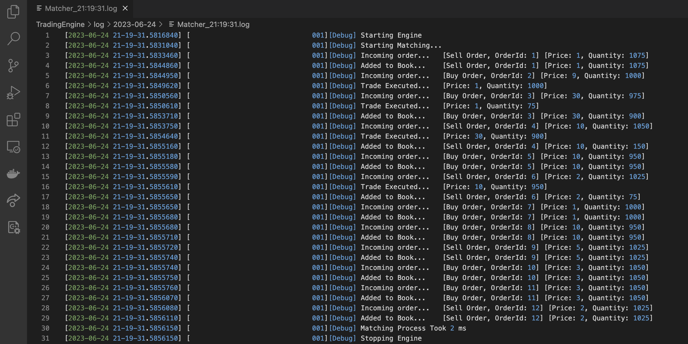

# <b>Matcher</b>

## <b>Overview</b>
`Matcher` is an algorithmic trading system that utilises the price-time priority matching algorithm.

This is a project to improve my familiarity with C#, following Object-Oriented (OO) design principles, and to expose myself further into how algorithms can make an impact in the trading scene.

This is how `Matcher` works in a nutshell:
1. Given a csv file containing mock order data, `TradingEngine` will read and process the data from the csv file using `DataParser`.
1. The processed data will be used to instantiate the relevant `Order` objects.
1. The matching process will be executed by `Matcher`.
1. Trades that are executed successfully are represented by `Trade` objects and orders that remain will be stored in the orderbook represented by `Book`.
1. The result of the matching algorithm will be saved into a log file by `LoggerModule`.

## <b>Progress</b>
- [x] Implement TradingEngine classes
- [x] Implement LoggerModule classes
- [x] Implement classes for Order 
- [x] Implement classes for Status
- [x] Implement classes for Limit
- [x] Implement OrderCore and OrderRecord
- [x] Implement orderbook interfaces
- [x] Implement classes for orderbook
- [x] Implement methods for the main Book class in Orderbook
- [x] Implement Matcher classes
- [x] Write some mock data (sequence of orders) in csv format
- [x] Implement DataParser classes (to parse csv and pass data to Matcher)
- [x] Test the TradingEngine with the mock data

<i>Further additions and enhancements to be confirmed...</i>